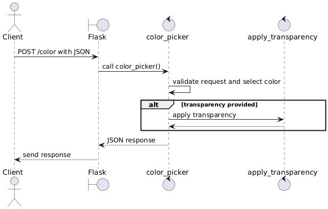

# Color Picker Microservice

This microservice provides a REST API for generating hex color codes, optionally with transparency.

It supports:
- Predefined named colors: red, green, blue, pink
- Random preset color
- Fully random color
- Optional transparency as a percentage (0–100)

Send your request to: http://localhost:5000/color


### Request Parameters

| Field          | Type    | Required | Description |
|----------------|---------|----------|-------------|
| `color`        | string  | Yes      | One of the following: `"red"`, `"green"`, `"blue"`, `"pink"`, `"random_preset"`, or `"random"` |
| `transparency` | number  | No       | Percentage value from 0 to 100. Optional. Adds an alpha value to the hex color. |

Example Request 1 (Python)
```python
response = requests.post(url, json={
    "color": "random",
    "transparency": 80
})
```
Example Resposne 1 (Python)
```python
{
  "color_name": "radom",
  "hex": "#00ff00cc"
}
```

Example Request 2 (Python)
```python
response = requests.post(url, json={
    "color": "green",
})
```

Example Resposne 2 (Python)
```python
{
  "color_name": "green",
  "hex": "#00ff0099"
}
```


### UML Diagram


